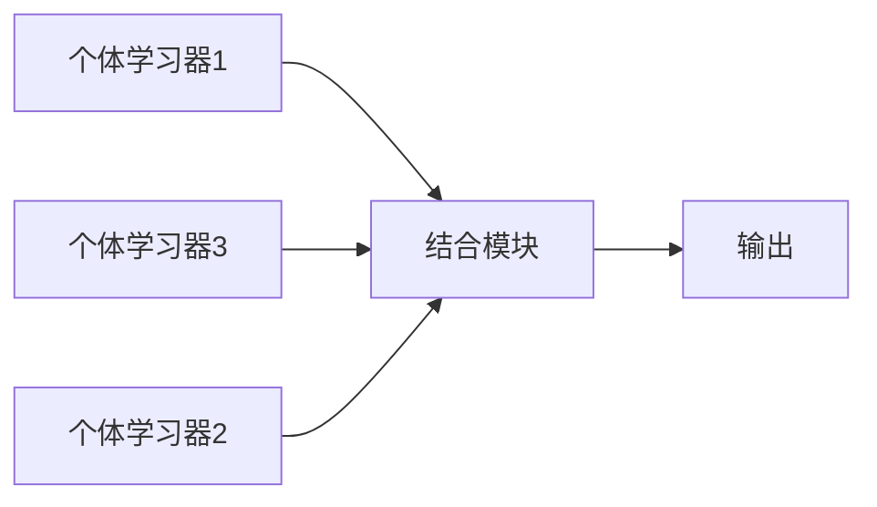

# 集成学习

## 1 个体与集成

​		集成学习(ensemble learning)通过构建多个学习器来完成学习任务，有时也称为多分类器系统(Multi-Classifier system)，每一个学习方法都是一个个体学习器，也称作基学习器(base learning algorithm)。

​		集成学习的主要思路简而言之就是一个算法不行，群体算法，不论是啥都上，通过对多个算法的整合，最终可获得比单一学习显著优越的算法泛化性能。

## 2 Boosting

​		Boosting是一种将弱学习器提升为强学习器的算法，是**串行**工作的。这类算法的工作机制类似于：首先从初始训练集训练出一个基学习器，再根据基学习器的测试情况对训练样本分布进行调整，对其的权重调整，使得先前学习器做错的训练样本在后续学习中收到更多关注。（***残差***）

​		Boosting中最有名的是（自适应提升）AdaBoost算法，主要思路是当前的状态由前一个状态所决定，利用树的残差构造，简单理解就是加入一棵树会比原来的更强。

## 3 Bagging与随机森林

​		Bagging是并行化集成学习方法最著名的代表。简单理解就是随机取样本然后对同一个算法进行大量训练，最终得到的结果进行**均值**等处理。

​		Bagging类中最典型的代表是随机森林（Random Forest），随机森林本质上是多个决策树并行放在一起，至于为什么**随机**，这是因为在决策树学习过程中，如果对于同样的数据不加任何处理，那么最后学习出来的决策树必然不会有任何差别，因此在学习过程开始前，首先**随机选取**开始样本（例如选取***60%***的样本）特征随意选择，构造不同的决策树，这样的结果才能有意义。

​		决策树并不是越多越好，大约100~200棵。

​		随机森林的优势：

* 可处理高维度（feature 较多）的数据，且不用进行特征选择
* 在训练完成之后，可以得出哪些特征比较重要
* 容易做成并行化方法，速度快
* 可以进行可视化展示，便于分析（***sklearn***）

	## 4 Stacking

​		Stacking先从初始数据集训练出初级学习器，然后生成一个新数据集用于训练次级学习器，堆叠在一起提高学习效率。

## 5 结合策略

### 5.1 平均法

​		平均法分为简单平均法和加权平均法。一般来说，当个体学习器性能相差较大时利用加权平均法，当个体学习器性能相差较小时可使用简单随机法。

### 5.2 投票法

​		分为绝大多数投票法和加权投票法。要注意的是，在进行集成学习过程后，如果对于某一类明显的预测效果不好，则直接将其剔除。