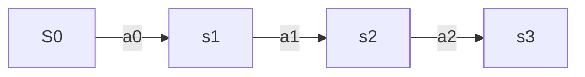
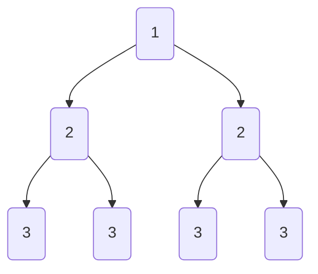

# 强化学习

## 1 基本概念

==智能体（agent）==：[棋盘] [小鸟]

==状态（state）==：[期盼分布] [棋局] [迷宫当前所处的位置]

==行为（action）==：[落子位置] [行走方向]

==奖励（reward）==：[衡量行为的正或负]

==策略（policy）==：[得到最大奖励值的动作组合]

​		在强化学习任务中，通过在环境中的不断尝试而学习到一个能够使长期累积奖励值最大策略，这个策略的优劣取决于长期执行这一策略后得到的累计奖赏。

## 2 马尔可夫决策

### 2.1 要求

1. 可以检测到理想的状态
2. 可以多次尝试
3. 系统的状态只与当前的状态有关，而与更早的状态无关，在决策过程中还与当前采取的动作有关

S：表示状态集（states）

A：表示动作集合（actions）

P：表示状态转移概率$P_{sa}$

表示当前$s\in S$状态下，经过a∈A的动作之后，会转移到的其他状态的概率分布情况。在状态s下执行动作a转移到s‘的概率可表示为：
$$
P(s'|s,a)
$$
R：奖励函数（reward function）。表示agent采取某个动作之后的即时奖励。

γ：折扣系数。意味着当下的reward比未来的reward更重要

### 2.2 决策过程

1. 智能体初始状态为S~0~
2. 选择动作a~0~
3. 按照概率转移矩阵$P_{sa}$转移到下一个状态S~1~

**状态价值函数**
$$
v[s]=E[v_t|s_t=s]
$$
t时刻的状态S所获得的未来回报的期望。价值函数用来衡量某一动作对的优劣价值，累计奖励的期望。

==最优价值函数==：所有策略下最优累计奖励期望$V_*=max_\pi V_\pi(s)$

==策略==：已知状态下所能产生动作的概率分布

## 3 Bellman方程

​		当前状态的价值和下一步的价值及当前的奖励（Reward）有关价值函数分解为==当前的奖励==和==下一步的价值==两部分。

first floor:
$$
V_\pi(S)←S
$$
$\pi$是给定状态s的情况下，动作a的概率分布，因为动作空间A和状态空间S均为==有限集合==，所以我们可以用来求解计算模型。

second floor:子状态（概率条件下的状态变换）

third floor：
$$
V_\pi(S')←S'
$$

式1：$\pi(a|s)$ 动作概率分布，$R_s^a$即时奖励，$γ$ 折扣因子，$P_{ss'}^a$状态转移矩阵，$v_\pi(S')$下一状态的奖励。而后直接$\sum$.

举例：

## 4 Q-Learning

$$
Q(s,a)=R(s,a)+γ\ max\{Q(S^-,a^-)\}
$$

​		其中s，a表示当前的状态和行为，$S^-$，$a^-$表示X的下个状态及行为，$γ ∈[0，1）$

step1：给定参数$γ$的reward矩阵R

step2：令Q==0

step3：For each episode:

​	3.1 随机选择初始状态

​	3.2 若未达到目标状态，则执行

​		（1）在当前状态s的所有可能取值中选取行为a

​		（2）利用选定的行为得到下一个状态

​		（3）按照公式计算Q（s，a）

​		（4）更新此状态$S==S^-$

举例：

