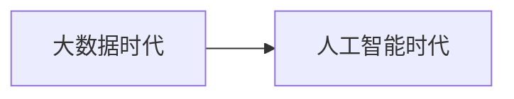
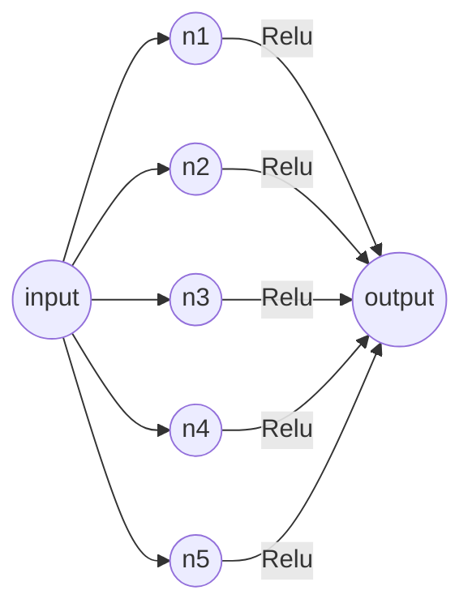

# 深度学习




## 1.图像分类：计算机视觉核心任务

计算机中的图像：一张图片被表示为三维数组的形式，每个像素的值从0-255（300\*300\*3）

挑战：照射角度

挑战：光照强度

挑战：形状变化

挑战：部分遮蔽

挑战：背景混入

常规套路：

1. 收集数据并给定标签
2. 训练一个分类器
3. 测试、评估

```python
#slmple show
def train():
    return model
def predict():
    return test_labels
```


**K-近邻算法**：通过指定K值判断该点属于的类别

对于位置类别属性数据点中的点:

1. 计算已知类别数据集中的点与当前点的距离
2. 按照距离依次排序
3. 选取与当前点距离最小的K个点
4. 确定前K个点所在类别的出现概率
5. 返回前K个点出现频率最高的类别作为当前点预测分类

简单高效，lazy-learning，不需要使用训练集进行训练，训练复杂度为0，KNN分类的计算复杂度和训练集中的文档数目成正比，也就是说，样本数为10，分类时间复杂度为o（n）。

但不能用在图像识别中：背景干扰

L1 （Manhattan）DISTANCE:$d_1(I_1,I_2)=\sum_p|I_1^p-I_2^p|$

”相应像素值相减“L2 (Euclidean) DISTANCE:$d_2(I_1,I_2)=\sqrt{\sum_p(I_1^p-I_2^p)^2}$

==测试数据只能最终用==

**交叉验证**：在训练集中另外开辟出一个验证集，平均分然后互相交叉验证


## 2.神经网络

### 2.1结构
（非线性，引入==激活函数==）

越多的神经元就越能表达越复杂的模型。



$Sigmoid:$  $f(x)=\frac {1}{1+e^{-x}}$ 容易发生梯度消失现象

$ReLU:$ $f（x）=max(0,x)$(主流激活函数)

### 2.2过拟合解决方案：

#### 2.2.1正则化项$\lambda\omega^2$（惩罚项）

损失函数：
$$
L(loss)=data_{loss}+\lambda\omega^2
$$

#### 2.2.2$Softmax$函数和交叉熵

如果是分类问题，可以采用$Softmax$数和交叉熵的组合

SVM输出的是一个得分的值，$Softmax$的输出是概率（归一化的概率）。

损失函数：**交叉熵损失（$log$）**


DROP-OUT在训练神经网络的时候，因为全连接层参数太多，容易过拟合，因此在迭代的时候随机需要丢弃一些神经元，不更新它的权值（可用迭代次数弥补）。

### 2.3线性分类

得分函数(决策边界)：
$$
f(x,\omega)_{10\times1}=W_{10\times3072}x_{3072\times1}+(b)_{10\times1}
$$

### 2.4损失函数

例子：SVM损失函数，衡量当前模型预测效果

用当前label和别的类计算差异，如果label分数大于其他类（损失函数=0，预测效果较好），则预测还行，反之损失函数比较大（预测效果不好），超过容忍程度。

### 2.5优化

前向传播&反向传播

前向传播，跟随梯度：
$$
\frac {df(x)}{dx}=\lim_{h→0}\frac{f(x+h)-f(x)}{h}
$$
学习率（Learning Rate）：算完梯度之后会乘以学习率，即每次下降的幅度。


反向传播（返回调参，更新权重偏置）：

1. 加法门单元：均等分配
2. MAX门单元：给最大的
3. 乘法门单元：互换


