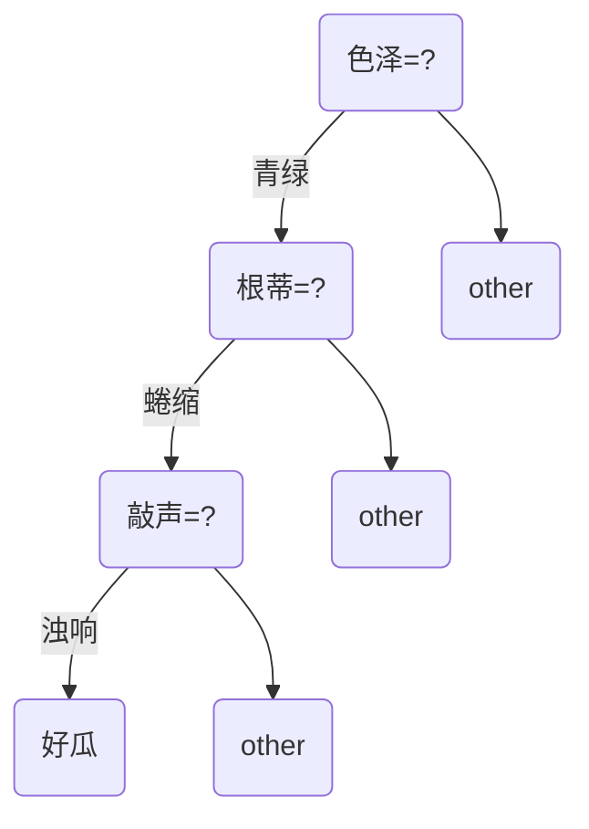
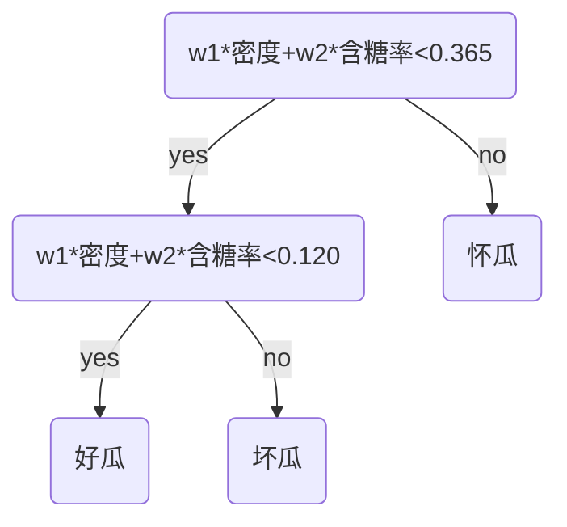

# 决策树(P73)

## 1 基本流程

​		决策树是基于树结构来进行决策的，这与人类在面对实际问题时的思路别无二致，决策树的最终结果对应着我们所希望的判定结果。所有数据最终都会到叶子节点中。

## 2 划分选择

​		一般而言，我们希望决策树的分支节点所包含的样本尽可能的属于同一类别，即节点的纯度（purity）越来越高。

### 2.1 信息熵

​		“信息熵”(information entropy))是度量样本集合纯度最常用的一种指标。类似于化学中的熵表示，表达的是样本集合中的“纯度”。

### 2.2 信息增益

​		一般而言，信息增益(information gain)越大,则意味着使用属性a所获得的“纯度提升”越大，因此，我们可以用“信息增益”来进行决策树的属性划分选择。表示特征X使得类Y的不确定性减少的程度。著名的ID3决策树算法就是以信息增益为衡量标准。

### 2.3 增益率

​		增益率=信息增益/自身的熵值。在实际问题中发现如果将编号ID没有忽略，则最终分类结果每个叶子节点中纯度非常高，但此类编号ID泛化能力弱，因此需要将信息增益/自身熵值来解决此问题。

​		需注意的是，增益率准则对可取值数目较少的属性有所偏好。因此C4.5算法并不是直接取增益率最高的候选划分属性，而是使用了一个启发性算法，先从侯选属性划分属性中找出信息增益高于平均水平的属性，再从中选择增益率最高的。

### 2.4 基尼系数

​		CART决策树中使用基尼系数来选择划分属性，即数据集D的纯度可用基尼系数来表示。

### 2.5 剪枝策略

​		剪枝(pruning)是决策树学习算法对付“过拟合”的手段，在决策树学习中，为了尽可能的正确分类训练样本，往往对节点划分过程不断重复，有时会造成决策树分支过多，造成过拟合的风险。

#### 2.5.1 预剪枝

​		主要思路是在决策树生成过程中，对每个节点在划分前进行估计，若当前节点的划分不能带来决策树泛化性能提升，则不对其进行划分。预剪枝主要策略有：

​		（1）限制决策树深度

​		（2）限制叶子节点个数

​		（3）限制叶子节点中样本个数

​		（4）限制信息增益率

#### 2.5.2 后剪枝

​		主要思想是在决策树生成之后，然后自底向上的考察非叶子节点，若该子树替换为叶子节点之后提升泛化性能，则对其进行剪枝。这样的剪枝策略的训练时间开销会比预剪枝要大得多。

### 2.6 连续值处理

​		最简单的策略是采用二分法对连续属性进行处理，需要注意的是，与离散属性不同的是，连续属性还可以作为其后代节点的划分属性。

### 2.7 多变量决策树

​		若我们将每个属性都是为坐标空间中的一个坐标轴，那么决策树所生成的分类边界有一个明显的特点：轴平行，即它的分类结果由若干个与坐标轴平行的分段组成。但是实际情况往往不是这样，因此**多变量决策树**就是解决这个问题的。在此类问题中，非叶节点不再是仅仅针对某一个属性，而是属性的线性组合。

